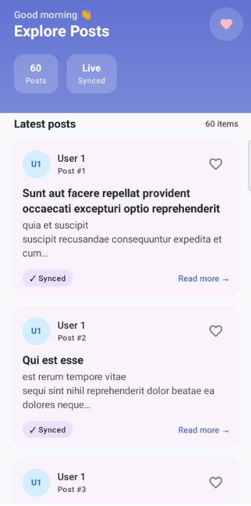
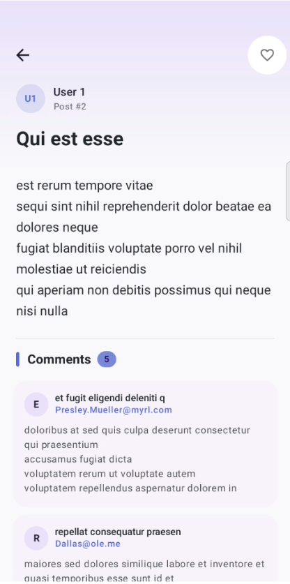
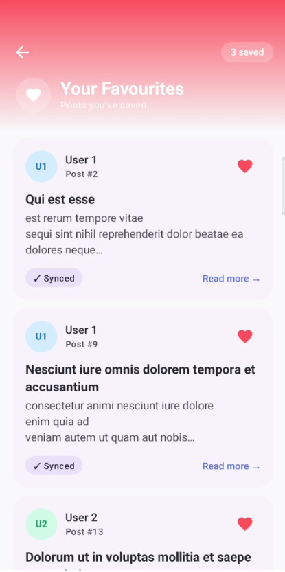

# CacheFlow - An Offline-First Android Boilerplate

A production-grade multi-module Android boilerplate that demonstrates offline-first architecture using Jetpack libraries, Kotlin Coroutines, Hilt dependency injection, and a clean separation of concerns across pure JVM and Android modules.

---

## Screenshots

| Home | Detail | Favourites |
|------|--------|------------|
|  |  |  |

---

## Tech Stack

| Category | Library | Version        |
|---|---|----------------|
| Language | Kotlin | 2.0.21         |
| Build System | Gradle | 8.6            |
| Android Gradle Plugin | AGP | 8.4.2          |
| UI Toolkit | Jetpack Compose + Material 3 | BOM 2024.10.00 |
| Navigation | Navigation Compose (type-safe) | 2.8.9          |
| Dependency Injection | Hilt | 2.51.1         |
| Local Database | Room | 2.7.2          |
| Networking | Retrofit 3 + OkHttp | 3.0.0 / 4.12.0 |
| Serialization | kotlinx.serialization | 1.8.1          |
| Async | Kotlin Coroutines + Flow | 1.10.2         |
| Pagination | Paging 3 | 3.3.6          |
| Logging | Timber | 5.0.1          |

---

## Module Architecture

```
:app                    (com.android.application)
 ├── :data         (com.android.library)
 │    ├── :domain  (org.jetbrains.kotlin.jvm)
 │    └── :network (org.jetbrains.kotlin.jvm)
 └── :testing      (com.android.library)
```

### Why the module split matters

| Module | Gradle Plugin | What lives here |
|---|---|---|
| `:app` | `android.application` | Compose UI, ViewModels, Navigation, DI wiring |
| `:domain` | **`kotlin.jvm`** | Domain models, Result\<T\>, repository interfaces, use cases |
| `:network` | **`kotlin.jvm`** | Retrofit interface, @Serializable DTOs |
| `:data` | `android.library` | Room DB, RemoteMediator, repository implementations, NetworkModule, DataStore, WorkManager |
| `:testing` | `android.library` | HiltTestRunner, MainDispatcherRule, shared test utilities |

`:domain` and `:network` are **pure JVM modules** — they have zero Android SDK on the classpath. Any accidental `import android.*` is a compile-time error, not a code-review miss. Retrofit, OkHttp, and kotlinx.serialization are all JVM-compatible libraries so they belong there naturally.

`NetworkModule` lives in `:data` (not `:network`) because the Hilt Gradle plugin `com.google.dagger.hilt.android` only applies to Android modules. There is no JVM variant of the Hilt plugin.

---

## Architecture

The app follows **Clean Architecture** with a strict unidirectional dependency rule:

```
UI (:app) → Domain (:domain) ← Data (:data) → Network (:network)
```

The domain layer has no knowledge of Android, Room, or Retrofit. It defines contracts (repository interfaces) and business logic (use cases) using only pure Kotlin.

### Unidirectional Data Flow

```
User action
    │
    ▼
ViewModel.fun()
    │
    ▼
UseCase (single responsibility)
    │
    ▼
Repository interface
    │
    ▼
Room DB (source of truth)          Network (background only)
    │                                      │
    └──────── Flow<Entity> ←───────────────┘
                                    RemoteMediator writes to DB
    ▼
ViewModel maps to UiState (StateFlow)
    │
    ▼
Screen collects via collectAsStateWithLifecycle()
    │
    ▼
Recompose
```

---

## Offline-First Strategy

Room is the **single source of truth**. The UI never reads directly from the network.

### How it works

**First launch (empty cache)**
1. `Pager` creates a `PostRemoteMediator`
2. `RemoteMediator.initialize()` checks cache age — cache is empty so returns `LAUNCH_INITIAL_REFRESH`
3. Mediator fetches page 1 from the API and writes to Room inside a `withTransaction`
4. Room invalidates the `PagingSource` — UI renders immediately

**Subsequent launches (fresh cache)**
1. `RemoteMediator.initialize()` checks cache age against `CACHE_TIMEOUT_MILLIS` (30 min)
2. Cache is fresh → returns `SKIP_INITIAL_REFRESH`
3. UI renders cached data instantly — no network call

**Scroll to bottom (append)**
1. Paging 3 detects boundary, calls `RemoteMediator.load(LoadType.APPEND)`
2. Mediator reads the remote key for the last item to find the next page number
3. Fetches next page, writes to Room — UI appends smoothly

**Pull-to-refresh / background sync**
1. `syncPosts()` is called from `HomeViewModel.refresh()`
2. Clears non-favourite rows from Room, fetches page 1 from API, upserts
3. `PagingSource` invalidates — UI reloads from the updated cache

**Favourites are never evicted**
`clearNonFavorites()` only deletes rows where `isFavorite = 0`. A user's saved posts survive every cache invalidation. The `isFavorite` flag is also read before every network upsert so a refresh never accidentally clears a favourite.

### Remote Keys

A `RemoteKeyEntity` table stores `prevKey` and `nextKey` for each post. This lets the mediator resume pagination correctly after:
- App restart
- Process death
- Manual refresh

---

## Dependency Injection

### Why `NetworkModule` lives in `:data`

The Hilt Gradle plugin (`com.google.dagger.hilt.android`) only works on Android modules. `:network` is a `kotlin.jvm` module — it produces a JAR, not an AAR — so the plugin cannot be applied there. `NetworkModule` is placed in `:data`, the first Android module that depends on `:network`.

### The `@BaseUrl` qualifier

`NetworkModule` needs the API base URL but must not import `BuildConfig` (which belongs to `:app`). A `@BaseUrl` qualifier is declared in `:data/di/Qualifier.kt` and provided by `AppModule` in `:app`, which reads `BuildConfig.BASE_URL`. This keeps the data module environment-agnostic.

```
:app/AppModule  →  @Provides @BaseUrl fun provideBaseUrl() = BuildConfig.BASE_URL
                        ↓
:data/NetworkModule  →  @Provides fun provideRetrofit(@BaseUrl baseUrl: String)
```

---

## Navigation

Type-safe navigation using the Navigation 2.8+ `@Serializable` route API — no string templates, no `backStackEntry.arguments?.getString(...)`.

```kotlin
sealed interface Screen {
    @Serializable data object Home     : Screen
    @Serializable data class Detail(val postId: Int) : Screen
    @Serializable data object Favorites : Screen
}

// Navigate
navController.navigate(Screen.Detail(postId = 42))

// Extract in ViewModel — no manual argument parsing
val postId = savedStateHandle.toRoute<Screen.Detail>().postId
```
---

## Connectivity & Offline Banner

`ConnectivityObserver` wraps `ConnectivityManager.NetworkCallback` in a `callbackFlow`. It emits the current network status immediately on first collect so the UI doesn't have to wait for the next network event.

When the device goes offline, a `OfflineOverlay` appears until connectivity is restored. When the network comes back, the overlay dismisses.